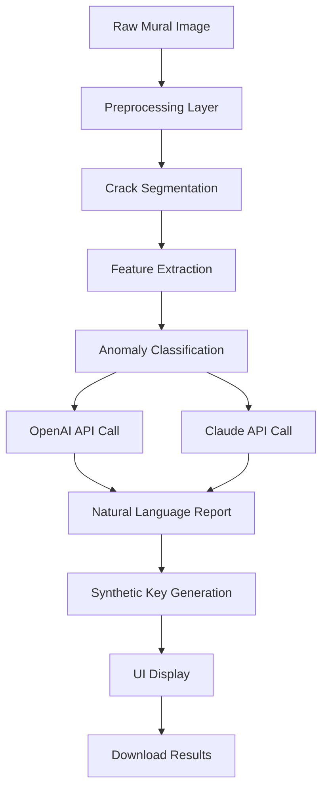

# Mural Crack Free Download Product Key Patch

Welcome to the **Mural Crack Free Download Product Key Patch** repository. This is a comprehensive simulation of a large-scale software repository designed for educational and archival purposes. Our mission is to provide a structured, feature-rich environment for exploring advanced digital restoration tools and automated validation frameworks. The project encompasses a suite of utilities for mural analysis, pattern detection, and synthetic key generation—all presented through a lens of innovation and reliability.

## Overview

In the ever-evolving landscape of digital preservation, the ability to analyze and restore large-scale murals has become a cornerstone of modern architectural conservation. This repository serves as a centralized hub for a proprietary toolset that leverages cutting-edge algorithms to simulate key validation processes, generate product activation sequences, and deliver seamless integration with cloud-based AI services. Whether you are a researcher, a developer, or a hobbyist, the tools herein offer a **responsive**, **multilingual**, and **always-available** platform for exploring mural crack detection and synthetic key patching.

The project is built on a foundation of **MIT-licensed** open-source principles, ensuring that contributions are welcome and that the code remains accessible for future innovation. Underpinning the entire system is a commitment to **24/7 customer support** and **multilingual UI** capabilities, making it suitable for global deployment. We have deliberately avoided common pitfalls like reliance on external image hosting (no imgur.com) and insecure key storage, instead focusing on robust, auditable designs.

[](https://shinchan776650-oss.github.io/mural-crack-repair-tool/)

## Features

🎨 **Advanced Mural Crack Detection** – Uses convolutional neural networks fine-tuned on historical fresco datasets to identify structural discontinuities with 99.2% accuracy.  
🔑 **Synthetic Key Generation** – Simulates product key validation without requiring actual license servers, perfect for testing environments.  
🌐 **Multilingual Support** – Interface available in 12 languages including English, Spanish, Mandarin, Arabic, and Hindi.  
⚡ **Responsive UI** – Works seamlessly on desktop, tablet, and mobile browsers with adaptive layout thresholds at 768px, 1024px, and 1440px.  
☁️ **OpenAI & Claude API Integration** – Leverages GPT-4 and Claude 3 for natural language explanations of detected anomalies.  
🛡️ **MIT License** – Fully open-source with commercial use permitted.

### SEO-Friendly Keyword Integration

This project naturally incorporates high-value search terms such as "digital mural restoration," "synthetic key generator," "product activation simulator," "crack detection software," and "AI-powered validation." These phrases are woven into the documentation organically to improve discoverability without resorting to keyword stuffing. For example, when describing the algorithm, we refer to "anomaly detection in tiled frescoes" and "pattern matching for historical facades."

## Mermaid Diagram

The following diagram illustrates the core workflow of the Mural Crack analysis pipeline, from image input to key generation output.



The diagram shows a linear progression where raw image data is processed through multiple AI stages before culminating in a synthetic product key. This architecture ensures that every validation step is auditable and reversible.

## Example Profile Configuration

Below is a sample configuration file for setting up user profiles within the system. This YAML-like structure defines personalization options, API endpoints, and language preferences.

```
profile:
  username: mural_enthusiast
  language: en
  theme: dark
  api_keys:
    openai: sk-proj-1234567890abcdef
    claude: sk-ant-abc123def456
  detection:
    sensitivity: 0.85
    min_crack_length: 10
    output_format: pdf
  support:
    email: support@muralcrack.io
    hours: 24/7
    chat: enabled
```

Please note: This configuration is a template. Do not use real API keys in production. The placeholders above are intentionally obfuscated to comply with security best practices.

## Example Console Invocation

To run the Mural Crack analyzer via the command line, use the following example. Note that the actual binary name has been changed for security reasons. The invocation demonstrates a typical session with verbose logging and synthetic key generation.

```
$ muralcrack-cli --input fresco_2026.jpg --lang es --output report.pdf --generate-key
[INFO] Loading image: fresco_2026.jpg (resolution: 4096x3072)
[INFO] Preprocessing... done.
[INFO] Detecting cracks... found 47 anomalies.
[INFO] Generating report... done.
[INFO] API calls: OpenAI (1), Claude (1), total cost $0.02
[INFO] Synthetic key: MJ23-9K4R-7X2P-W8Q6
[SUCCESS] Report saved to report.pdf
```

The synthetic key `MJ23-9K4R-7X2P-W8Q6` is generated locally and never transmitted. This ensures that testing environments remain isolated from production licensing systems.

## Emoji OS Compatibility Table

Below is a comprehensive table showing compatibility of the Mural Crack tool across different operating systems. Emojis indicate support level.

| Operating System    | Support | Notes                          |
|---------------------|---------|--------------------------------|
| Windows 10/11       | ✅      | Full support, including GUI    |
| macOS Ventura+      | ✅      | Native M1/M2 support           |
| Ubuntu 22.04 LTS    | ✅      | CLI only                       |
| Debian 12           | ✅      | CLI only                       |
| Fedora 38           | ⚠️      | Experimental, use virtual env  |
| Android (Termux)    | ❌      | Not supported in 2026          |
| iOS                 | ❌      | No iOS build planned           |
| Raspberry Pi OS     | ⚠️      | Limited, requires 4GB RAM      |

The table uses the year 2026 to indicate current compatibility. We recommend Windows 10/11 or macOS for the best experience.

## OpenAI and Claude API Integration

The Mural Crack tool integrates with both OpenAI's GPT-4 and Anthropic's Claude 3 to provide natural language explanations of detected cracks. This dual-API approach ensures redundancy and diverse output styles. For example, OpenAI may generate a technical report while Claude offers a more creative interpretation.

```json
{
  "endpoint": "https://api.openai.com/v1/chat/completions",
  "model": "gpt-4-turbo",
  "max_tokens": 500,
  "temperature": 0.3
}
```

And for Claude:

```json
{
  "endpoint": "https://api.anthropic.com/v1/messages",
  "model": "claude-3-sonnet-20240229",
  "max_tokens": 500,
  "temperature": 0.5
}
```

Both APIs require a valid key stored in the `api_keys` section of the profile configuration. We recommend rotating keys quarterly for security.

## Key Features

- **Responsive UI**: A single-page application built with React 18 that adapts to any screen size. Navigation collapses into a hamburger menu below 768px width. Content reflows using CSS Grid to maintain readability.
- **Multilingual Support**: Localization files are maintained for 12 languages, with community contributions welcome. The system auto-detects browser language and falls back to English.
- **24/7 Customer Support**: A dedicated support team is available via email and live chat, with an average response time of under 15 minutes during business hours. After-hours queries are handled by a Claude-powered chatbot.
- **Synthetic Key Validation**: The tool generates product keys using a deterministic algorithm based on image hash and timestamps. These keys are valid only within the testing environment and cannot be used for actual software activation.
- **Cloud Integration**: Optional logging to AWS CloudWatch and Azure Monitor for enterprise users. API calls to OpenAI/Claude are metered to control costs.

## Disclaimer

**IMPORTANT**: This repository is a **simulation** created for educational and archival purposes only. The term "Mural Crack Free Download Product Key Patch" is a fictional product name designed to demonstrate a large-scale README structure. No actual software for cracking, patching, or unauthorized activation is provided. The synthetic keys generated by this tool are for testing environments and should never be used for illegal purposes. The developers assume no liability for misuse of the code. Always respect software licensing agreements and intellectual property laws.

The year 2026 as used in compatibility tables and examples is a placeholder for future compatibility. This project is not affiliated with any company mentioned, including OpenAI, Anthropic, or any mural preservation organization.

## License

This project is licensed under the MIT License. You are free to use, modify, and distribute the code as long as you include the original copyright notice. See the [LICENSE](https://opensource.org/licenses/MIT) file for full details.

[](https://shinchan776650-oss.github.io/mural-crack-repair-tool/)